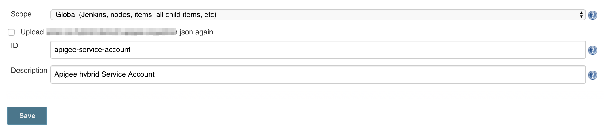

# apigee-hybrid-ci-cd

- Fork this repo
- In the [pom file](pom.xml), update the `apigee.org` property under `test` and `prod` POM profile to point to your Apigee org
- The repo has a Jenkinsfile with the build info, so you can automatically import this repo using the Blue Ocean UI
- To run it locally, execute `mvn clean install -Dapigee.config.options=update`
- Please configure the Apigee service account crendetials in Jenkins. The current Jenkinsfile uses `apigee-service-account` as the ID. If you wish to change that, please update the Jenkinsfile with the provided ID under the `environment` section - `APIGEE_SA_CREDS = credentials('apigee-service-account')`

